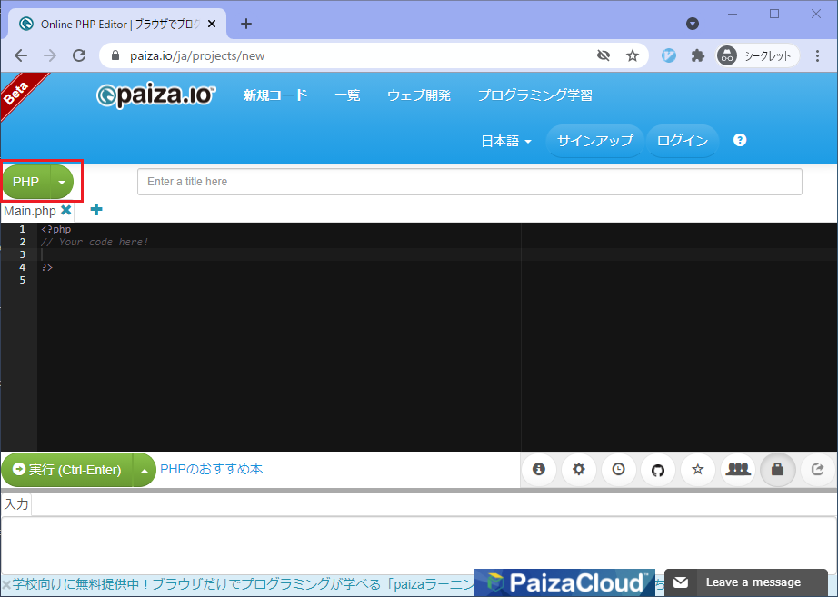
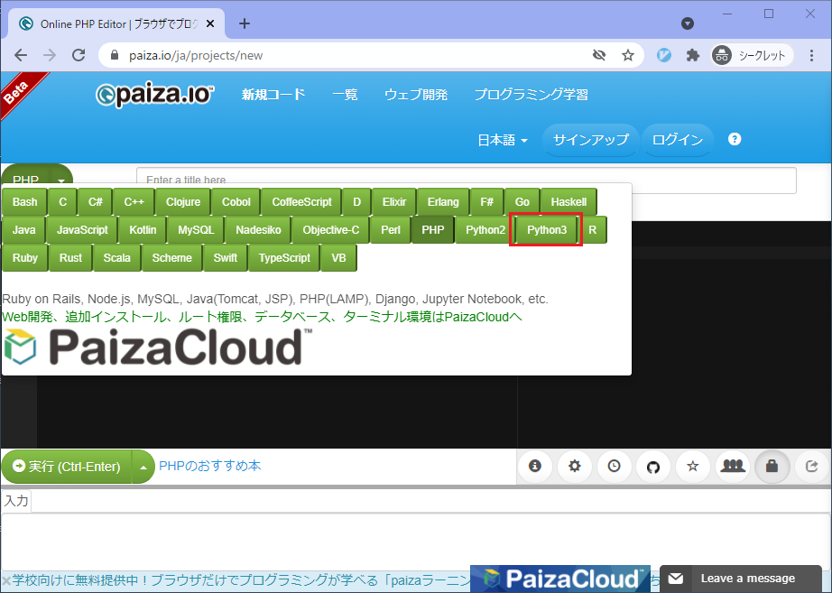
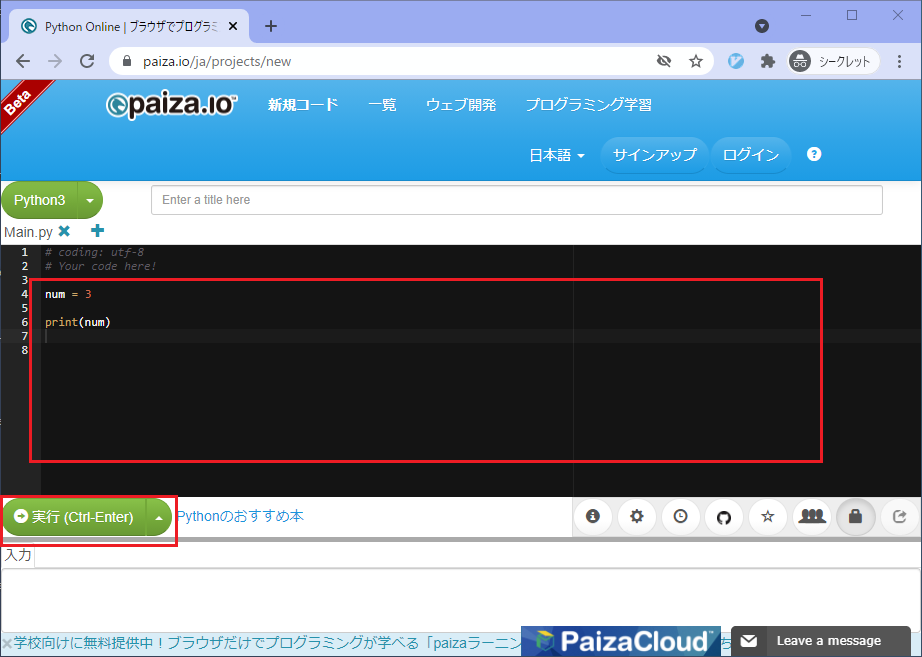
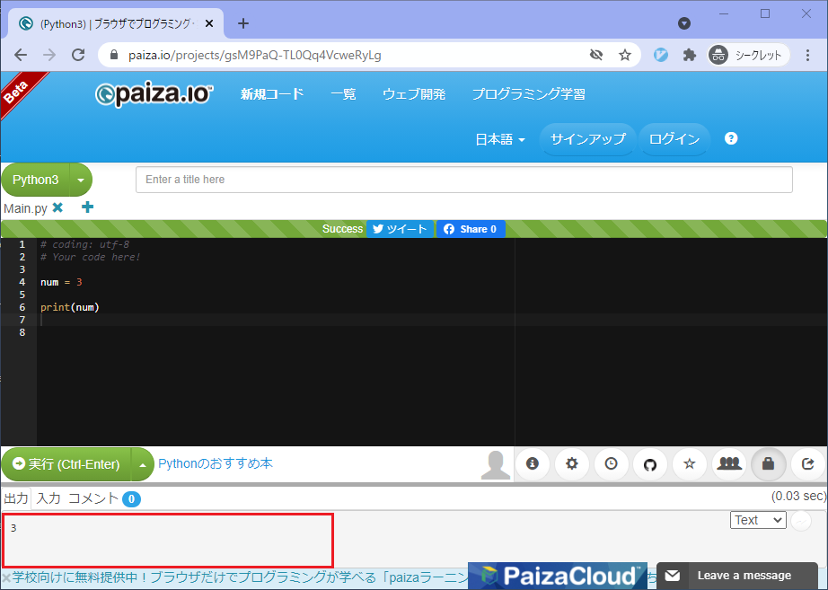

# Python(C++)の実行環境
pythonの実行環境は、大きく分けて以下の２つに分けられます。  

- 自分のPC上で動かすパターン  
- オンラインのwebブラウザ上で動かすパターン  

プログラミング初心者の方は、まずはオンラインの実行環境で動かしてみることをおすすめします。
(環境構築作業が上手く行かず、プログラミングで挫折してしまうのは、もったいない)

## オンラインで実行
- 下記のpaizaのオンライン実行環境がアカウント登録も不要で使えるので便利だと思います。  
  <https://paiza.io/ja>  
 
  

??? note "paizaでの実行手順"
    - 下記サイトにアクセスする  
    <https://paiza.io/ja>

    - **コード作成を試してみる**ボタンをクリックする  
      
  
    - **PHP**ボタンをクリックする  
      
  
    - 使いたい言語を選択すボタン一覧が表示されるので、**Python3**ボタンをクリックする  
      (**python2**では無いことに注意！)  
      
  
    - エディタエリア(黒画面エリア)に試したいpythonのコードを記述して、実行ボタンを押す
      
  
    - 画面下の出力エリアに実行結果が表示される  
      

## 自分のPC上で実行
  coming soon...
